# Jarkom-Modul-2-2026-K-35

----
| Nama | NRP |
| ---------------------- | ---------- |
| Dea Chrisna Butarbutar | 5027241035 |
| Pradipta Airlangga Ramadhan | 5027241118 |
----

# IP Address Host : 10.4.89.247

# IP Prefix : 10.81.x.x

# Shadow Net Operation
Author: Rootkids & Obladioblada

## Soal-1
Sebagai pusat kesadaran The Mesh, rootkit harus merentangkan koneksinya ke lima gerbang utama (Switch). Tetapkan alamat IP dan default gateway untuk seluruh Entitas, mulai dari para operator (alpha, beta, gamma), penjaga directory (prab, tedd), gerbang penyaring (abbey, penny), hingga repository (obladi, desmond, oblada, molly) sesuai dengan topologi pembagian switch yang dirancang.

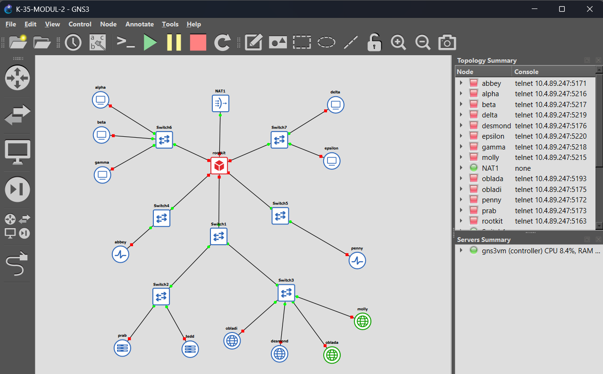

Pada bagian ini, kita membuat topologi dengan pembagian sebagai berikut.
- Operator (Switch6): alpha, beta, dan gamma
- Penjaga directory (Switch2): prab dan tedd
- Gerbang penyaring (Switch4 dan Switch5): abbey dan penny
- Repository (Switch3): obladi, desmond, oblada, molly

## Soal-2
Meskipun The Mesh beroperasi dalam bayang-bayang, Rootkit menyadari bahwa Entitas di dalamnya masih membutuhkan asupan paket dari dunia luar. Buka jalur menuju NAT dengan memastikan antarmuka WAN di router rootkit aktif. Konfigurasikan NAT agar dapat meneruskan lalu lintas keluar bagi seluruh alamat internal, sehingga semua host di dalam jaringan dapat menjangkau internet publik menggunakan IP address.

Untuk menghubungkan semuanya lintas jalur dan internet, maka kita menambahkan konfigurasi di bagian router rootkit bagian eth0 sebagai berikut.
```   
   up sysctl -w net.ipv4.ip_forward=1
   up iptables -t nat -A POSTROUTING -o eth0 -j MASQUERADE
   up iptables -A FORWARD -i eth1 -o eth0 -j ACCEPT
   up iptables -A FORWARD -i eth2 -o eth0 -j ACCEPT
   up iptables -A FORWARD -i eth3 -o eth0 -j ACCEPT
   up iptables -A FORWARD -i eth4 -o eth0 -j ACCEPT
   up iptables -A FORWARD -i eth5 -o eth0 -j ACCEPT
   up iptables -A FORWARD -i eth0 -m state --state ESTABLISHED,RELATED -j ACCEPT 
```

Kita melakukan konfigurasi pada setiap console, baik router dan non-router:

Rootkit
```
auto eth0
iface eth0 inet dhcp

auto eth1
iface eth1 inet static
    address 10.81.1.1
    netmask 255.255.255.0

auto eth2
iface eth2 inet static
    address 10.81.4.1
    netmask 255.255.255.0

auto eth3
iface eth3 inet static
    address 10.81.5.1
    netmask 255.255.255.0

auto eth4
iface eth4 inet static
    address 10.81.6.1
    netmask 255.255.255.0

auto eth5
iface eth5 inet static
    address 10.81.7.1
    netmask 255.255.255.0
```

Alpha
```
auto eth0
iface eth0 inet static
	address 10.81.6.10
	netmask 255.255.255.0
	gateway 10.81.6.1
```

Beta
```
auto eth0
iface eth0 inet static
	address 10.81.6.10
	netmask 255.255.255.0
	gateway 10.81.6.1
```

Gamma
```
auto eth0
iface eth0 inet static
	address 10.81.6.12
	netmask 255.255.255.0
	gateway 10.81.6.1
```

Abbey
```
auto eth0
iface eth0 inet static
	address 10.81.4.10
	netmask 255.255.255.0
	gateway 10.81.4.1
```

Penny
```
auto eth0
iface eth0 inet static
	address 10.81.5.10
	netmask 255.255.255.0
	gateway 10.81.5.1
```

Delta
```
auto eth0
iface eth0 inet static
	address 10.81.7.10
	netmask 255.255.255.0
	gateway 10.81.7.1
```

Epsilon
```
auto eth0
iface eth0 inet static
	address 10.81.7.11
	netmask 255.255.255.0
	gateway 10.81.7.1
```

Prab
```
auto eth0
iface eth0 inet static
    address 10.81.1.10
    netmask 255.255.255.0
    gateway 10.81.1.1
```

Tedd
```
auto eth0
iface eth0 inet static
    address 10.81.1.11
    netmask 255.255.255.0
    gateway 10.81.1.1
```

Obladi
```
auto eth0
iface eth0 inet static
    address 10.81.1.12
    netmask 255.255.255.0
    gateway 10.81.1.1
```

Desmond
```
auto eth0
iface eth0 inet static
    address 10.81.1.13
    netmask 255.255.255.0
    gateway 10.81.1.1
```

Oblada
```
auto eth0
iface eth0 inet static
    address 10.81.1.14
    netmask 255.255.255.0
    gateway 10.81.1.1
```

Molly
```
auto eth0
iface eth0 inet static
    address 10.81.1.15
    netmask 255.255.255.0
    gateway 10.81.1.1
```

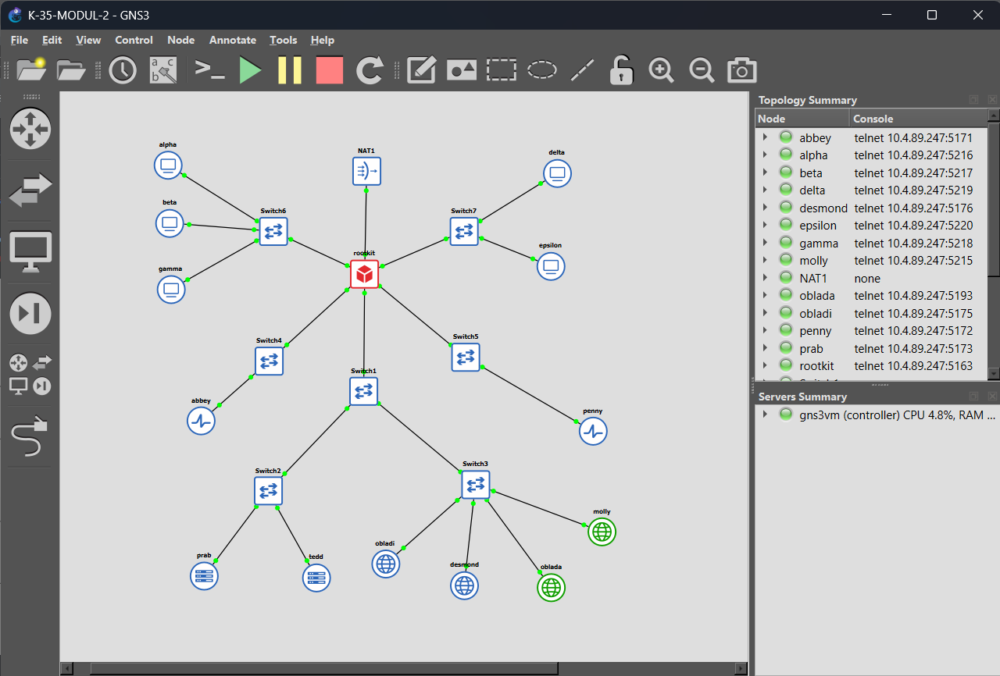

## Soal-3
Jaringan rahasia tidak akan berfungsi tanpa sinkronisasi antar divisi. Pastikan seluruh Entitas dapat saling terhubung dan berkomunikasi lintas jalur (routing internal via rootkit berfungsi). Untuk menghindari fragmentasi saat persiapan, pastikan setiap host non-router menambahkan resolver 192.168.122.1 (tambah di file /etc/resolv.conf, kalau sudah pakai resolver itu tidak perlu memasukkan resolver google) saat antarmukanya aktif agar akses untuk mengunduh paket instalasi dari internet tersedia sejak awal beroperasi.

Selanjutnya, menambah resolver 192.168.122.1 pada setiap host non-router:

```
echo "nameserver 192.168.122.1" > /etc/resolv.conf
```
Pengecekan dilakukan dengan ping antar host dan ke jaringan internet (google.com).

## Soal-4
Penjaga Direktori mulai menuliskan hukum The Mesh. Pada node prab, bangun zona <xxxx>.com sebagai authoritative dengan SOA yang menunjuk ke prab.<xxxx>.com, serta tambahkan catatan NS untuk prab.<xxxx>.com dan tedd.<xxxx>.com. Buat A record untuk prab.<xxxx>.com dan tedd.<xxxx>.com yang mengarah ke alamat IP mereka masing-masing, serta A record apex <xxxx>.com yang mengarah ke gerbang aplikasi dinamis (penny). Aktifkan fitur notify dan allow-transfer ke tedd, lalu set forwarders ke 192.168.122.1. Di node tedd, tarik zona <xxxx>.com dari master dan pastikan server menjawab secara authoritative. Setelah fondasi nama ini berdiri kokoh, perbarui urutan resolver pada seluruh Entitas non-router menjadi: IP prab, IP tedd, lalu 192.168.122.1. Verifikasi bahwa query ke domain apex maupun hostname di dalam zona dijawab dengan benar oleh prab atau tedd. 

Pertama, pada node prab, kita menginstall bind9.
```
apt-get update
apt-get install bind9 -y
ln -s /etc/init.d/named /etc/init.d/bind9
```
Untuk membuat domain untuk node prab, maka kita menjalankan command berikut.
```
cat <<EOF > /etc/bind/named.conf.local
zone "K35.com" {
  type master;
  notify yes;
  also-notify { 10.81.1.11; };
  allow-transfer { 10.81.1.11; };
  file "/etc/bind/jarkom/k35.com";
};
EOF
```
Dengan demikian, fitur notify dan allow-transfer ke tedd sudah aktif.

Kemudian, kita membuat file untuk zone.
```
mkdir /etc/bind/jarkom
nano /etc/bind/jarkom/k35.com
```

Isinya adalah sebagai berikut. 
```
$TTL    604800          ; Waktu cache default (detik)
@       IN      SOA     prab.k35.com. admin.k35.com. (
                        2026092801 ; Serial (format YYYYMMDDXX)
                        604800     ; Refresh (1 minggu)
                        86400      ; Retry (1 hari)
                        2419200    ; Expire (4 minggu)
                        604800 )   ; Negative Cache TTL
;

@       IN      NS      prab.k35.com.
@       IN      NS      tedd.k35.com.
prab    IN      A       10.81.1.10
tedd    IN      A       10.81.1.11
@       IN      A       10.81.5.10

```

Selanjutnya, isi juga script berikut pada `named.conf.option`
```
nano /etc/bind9/named.conf.options
```
Isinya adalah sebagai berikut.
```
options {
        directory "/var/cache/bind";

        forwarders {
                192.168.122.1;
        };
        allow-query { any; };
        auth-nxdomain no;
        listen-on { any; };
        listen-on-v6 { any; };
};
```
Dengan demikian, forwarder sudah diset ke `192.168.122.1`.

Agar konfigurasi berjalan, lakukan restart.
```
service bin9 restart
```
Dari node tedd, kita coba ping ke k35.com.
```
ping -c 5 k35.com
```
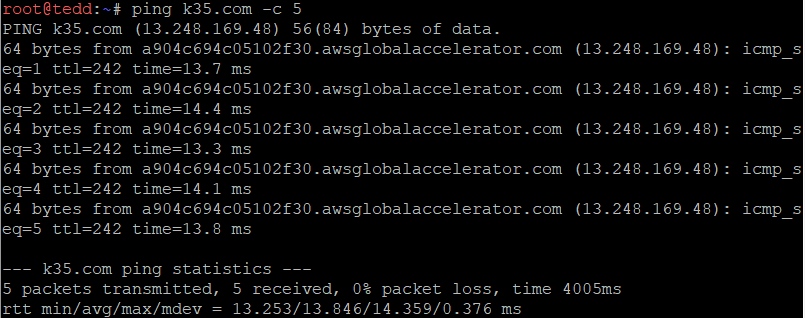
Maka, dari gambar tersebut, ping sudah berhasil.

Selanjutnya, kita membuat DNS Slave pada node tedd. Di sini, kita menginstall bind9 seperti pada DNS Domain. 
```
apt-get update
apt-get install bind9 -y
ln -s /etc/init.d/named /etc/init.d/bind9
service bind9 restart
```

Kemudian, kita melakukan konfigurasi pada zone slavenya.
```
cat <<EOF > /etc/bind/named.conf.local
zone "k35.com" {
    type slave;
    masters { 10.81.1.10; }; // Masukan IP VPC1 tanpa tanda petik
    file "/var/cache/bind/k35.com";
};
EOF
```
Restart bind9 untuk memperbarui.
```
service bind9 restart
```

Kembali pada node prab, kita menghentikan bind9 dengan command berikut.
```
service bind9 stop
```

Pada node tedd, kita melakukan ping untuk membuktikan dapat tersambung meskipun prab sudah diberhentikan.
```
ping -c 5 k35.com
```


Kemudian, untuk memperbarui urutan resolver menjadi IP prab, IP tedd, dan 192.168.122.1, jalankan command berikut pada seluruh node non-router.
```
echo "nameserver 10.81.1.10
nameserver 10.81.1.11
nameserver 192.168.122.1" > /etc/resolv.conf
```

Lalu, kita jalankan command berikut di node lain, misalnya pada node obladi.
```
dig k35.com
```
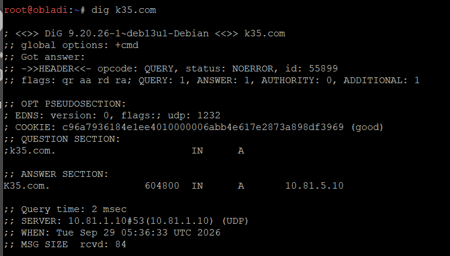

Maka, terlihat bahwa query ke domain apex dan hostname di dalam zone dijawab oleh prab dan tedd.

## Soal-5
"Entitas tanpa identitas adalah anomali," pesan Rootkit. Namai semua Entitas (hostname) sesuai glosarium: rootkit, alpha, beta, gamma, delta, epsilon, prab, tedd, abbey, penny, obladi, desmond, oblada, molly, dan verifikasi bahwa setiap host mengenali hostname tersebut secara system-wide. Buat setiap domain untuk masing-masing node sesuai dengan namanya (contoh: alpha.<xxxx>.com) dan assign IP masing-masing juga. Lakukan pengecualian untuk node yang bertanggung jawab atas prab dan tedd.

Untuk memverifikasi setiap host mengenail hostname yang sudah dibuat sebelumnya, kita membuat domain sesuai nama dan IP di dalam node prab.
```
nano /etc/bind/jarkom/k35.com
```

```
alpha   IN      A       10.81.6.10
beta    IN      A       10.81.6.11
gamma   IN      A       10.81.6.12
abbey   IN      A       10.81.4.10
penny   IN      A       10.81.5.10
delta   IN      A       10.81.7.10
epsilon IN      A       10.81.7.11
obladi  IN      A       10.81.1.12
desmond IN      A       10.81.1.13
oblada  IN      A       10.81.1.14
molly   IN      A       10.81.1.15
```
Naikkan serial SOA sebelum menyimpan perubahan di atas. Sebelumnya adalah `2026092801`, dinaikkan menjadi `2026092802`.

## Soal-6
Pastikan zone transfer berjalan, pastikan tedd telah menerima salinan zona terbaru dari prab. Nilai serial SOA di keduanya harus sama karena keduanya tidak bisa dipisahkan dan saling melengkapi.

Pertama, kita mengecek apakah zone transfer berjalan dengan menjalankan command berikut.
```
dig @10.81.1.10 k35.com AXFR
```
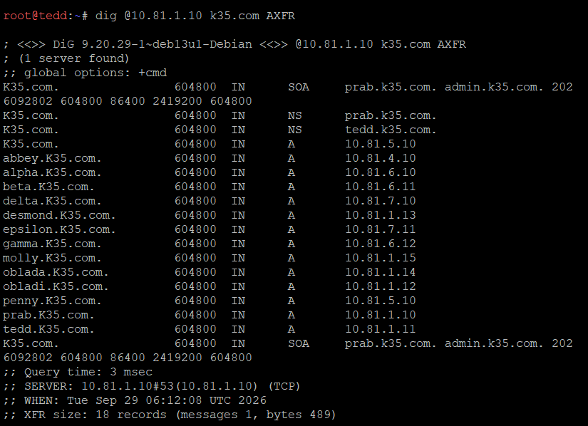

Kemudian, untuk mengecek kesamaan nilai serial SOA antara prab dan tedd, kita jalan command berikut.
```
dig @10.81.1.10 k35.com SOA
```
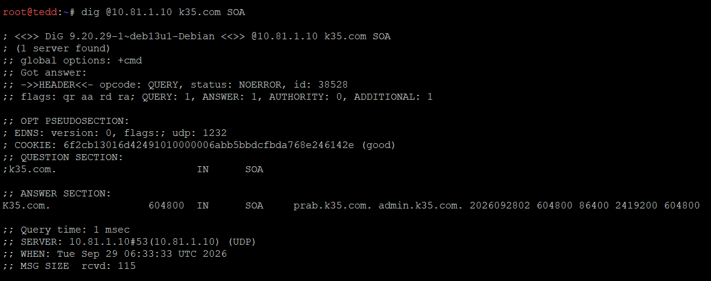

```
dig @10.81.1.11 k35.com SOA
```
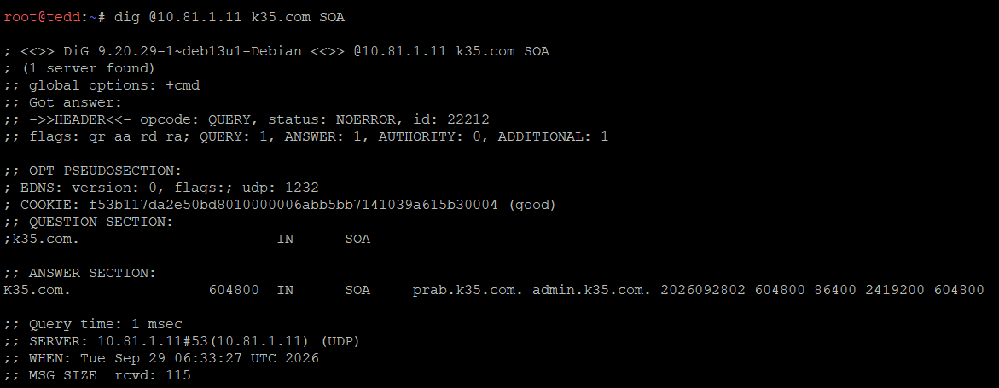

Kita bisa melihat bahwa serial SOA 2026092802 di kedua node.

## Soal-7
abbey dan penny sebagai gerbang utama, obladi dan desmond sebagai web statis, oblada dan molly sebagai web dinamis. Tambahkan pada zona <xxxx>.com A record untuk vault.<xxxx>.com (IP obladi & desmond), dan core.<xxxx>.com (IP oblada & molly). Tetapkan CNAME:
www.<xxxx>.com → penny.<xxxx>.com
static.<xxxx>.com → abbey.<xxxx>.com
Verifikasi dari dua klien berbeda bahwa seluruh hostname tersebut ter-resolve ke tujuan yang benar dan konsisten.

Kita membuat penny sebagai gerbang utama, obladi sebagai web statis, dan oblada sebagai web dinamis. Pada node prab, kita menambahkannya di file `k35.com`
```
nano /etc/bind/jarkom/k35.com
```
```
www     IN      CNAME   penny.k35.com.
static  IN      CNAME   abbey.k35.com.
vault   IN      CNAME   obladi.k35.com.
core    IN      CNAME   oblada.k35.com.
```

Lalu, naikkan serial SOA nya sebelum disimpan
```
service bind9 reload
```
Untuk mengecek apakah sudah berjalan, maka jalan command berikut di 2 node lain, kami membuatnya di alpha dan delta.
``` 
dig www.k35.com
```
```
dig vault.k35.com
```
```
dig static.k35.com
```
```
dig core.k35.com CNAME
```
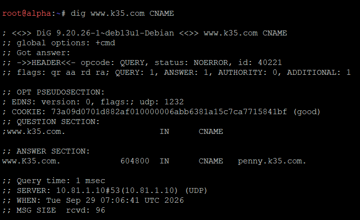
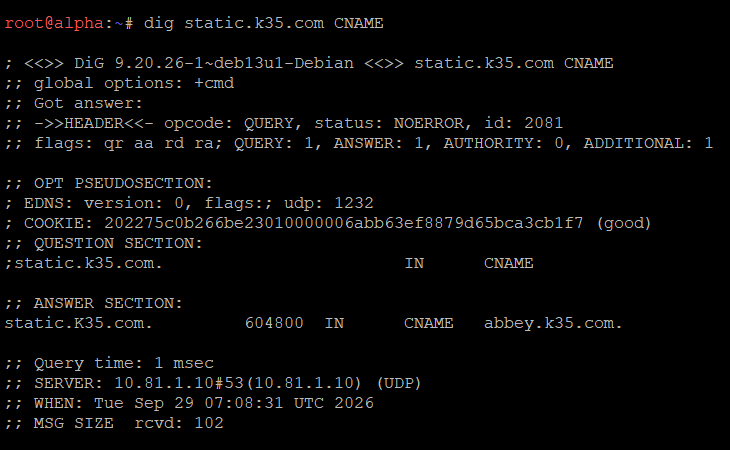
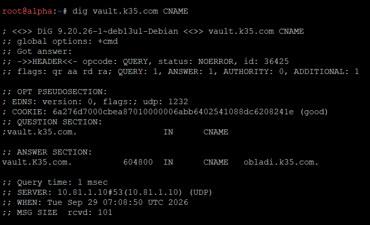
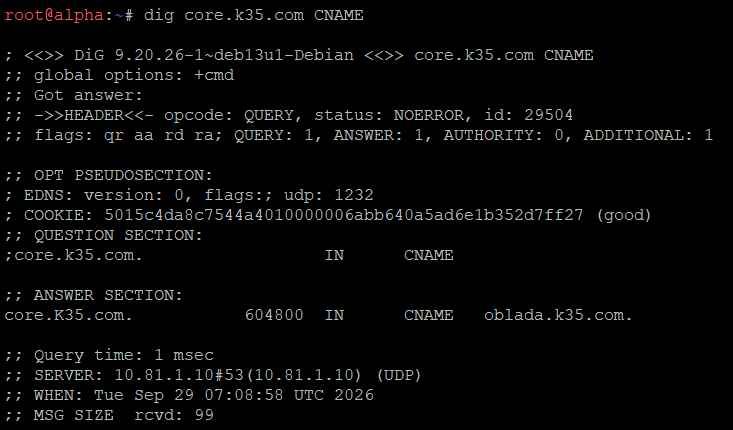
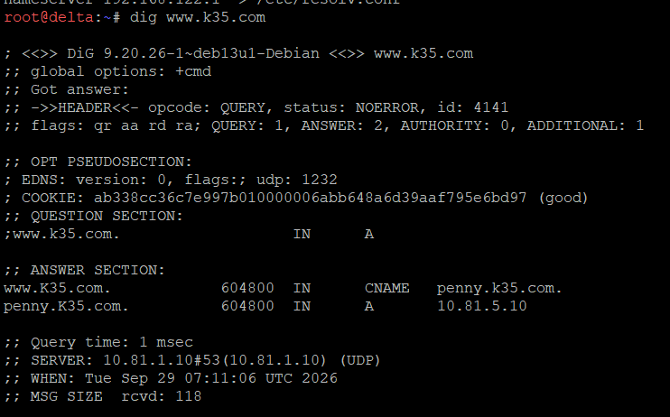
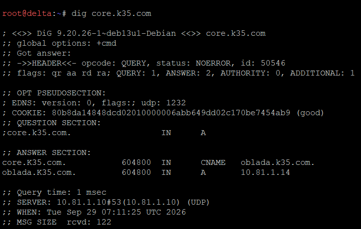
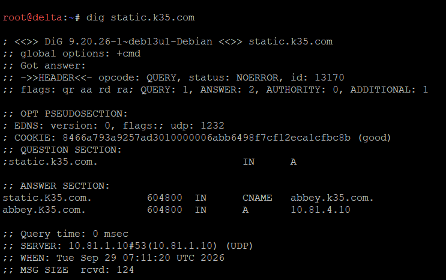
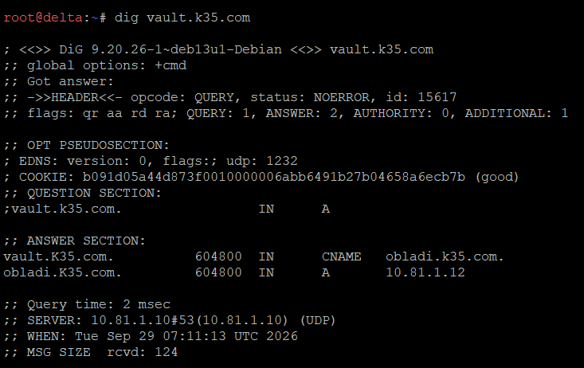

## Soal-8
Di prab (master) deklarasikan reverse zone untuk segmen jaringan  tempat abbey, penny, area vault, dan area core berada. Di tedd (slave) tarik reverse zone tersebut sebagai slave, isi PTR untuk keempat hostname itu agar pencarian balik IP address mengembalikan hostname yang benar, lalu pastikan query reverse untuk alamat abbey, penny, area vault, dan area core dijawab authoritative.

Untuk mendeklarasikan reverse zone, kita melakukan konfigurasi sebagai berikut. Tambahkan 
```
cat << 'EOF' >> /etc/bind/named.conf.local
zone "1.81.10.in-addr.arpa" {
        type master;
        notify yes;
        also-notify { 10.81.1.11; };
        allow-transfer { 10.81.1.11; };
        file "/etc/bind/jarkom/1.81.10.in-addr.arpa";
};

zone "4.81.10.in-addr.arpa" {
        type master;
        notify yes;
        also-notify { 10.81.1.11; };
        allow-transfer { 10.81.1.11; };
        file "/etc/bind/jarkom/4.81.10.in-addr.arpa";
};

zone "5.81.10.in-addr.arpa" {
        type master;
        notify yes;
        also-notify { 10.81.1.11; };
        allow-transfer { 10.81.1.11; };
        file "/etc/bind/jarkom/5.81.10.in-addr.arpa";
};
EOF
```
Kemudian, kita membuat file untuk masing-masing jaringan.
Untuk reverse zone jaringan `10.81.1`:
```
nano /etc/bind/jarkom/1.81.10.in-addr.arpa
```
Isinya adalah sebagai berikut.
```
$TTL    604800          ; Waktu cache default (detik)
@       IN      SOA     k35.com. root.k35.com. (
                        2026092901 ; Serial (format YYYYMMDDXX)
                        604800     ; Refresh (1 minggu)
                        86400      ; Retry (1 hari)
                        2419200    ; Expire (4 minggu)
                        604800 )   ; Negative Cache TTL
;

@       IN      NS      prab.k35.com.

12      IN      PTR     obladi.k35.com.
13      IN      PTR     desmond.k35.com.
14      IN      PTR     oblada.k35.com.
15      IN      PTR     molly.k35.com.
```
Untuk reverse zone jaringan `10.81.4`:
```
nano /etc/bind/jarkom/4.81.10.in-addr.arpa
```
Isinya adalah sebagai berikut.
```
$TTL    604800          ; Waktu cache default (detik)
@       IN      SOA     k35.com. root.k35.com. (
                        2026092901 ; Serial (format YYYYMMDDXX)
                        604800     ; Refresh (1 minggu)
                        86400      ; Retry (1 hari)
                        2419200    ; Expire (4 minggu)
                        604800 )   ; Negative Cache TTL
;

@       IN      NS      prab.k35.com.

10      IN      PTR     abbey.k35.com.
```

Untuk reverse zone `10.81.5`:
```
nano /etc/bind/jarkom/5.81.10.in-addr.arpa
```
Isinya adalah sebagai berikut.
```
$TTL    604800          ; Waktu cache default (detik)
@       IN      SOA     k35.com. root.k35.com. (
                        2026092901 ; Serial (format YYYYMMDDXX)
                        604800     ; Refresh (1 minggu)
                        86400      ; Retry (1 hari)
                        2419200    ; Expire (4 minggu)
                        604800 )   ; Negative Cache TTL
;

@       IN      NS      prab.k35.com.

10      IN      PTR     penny.k35.com.
```

Kemudian, cek ketiga zone tersebut dengan command ini:
```
named-checkzone 1.81.10.in-addr.arpa /etc/bind/jarkom/1.81.10.in-addr.arpa
named-checkzone 4.81.10.in-addr.arpa /etc/bind/jarkom/4.81.10.in-addr.arpa
named-checkzone 5.81.10.in-addr.arpa /etc/bind/jarkom/5.81.10.in-addr.arpa
```
Lalu, reload untuk menyimpan perubahan.
```
service bind9 reload
```

Pada node tedd, kita menarik reverse zone yang tadi sebagai slave.
```
cat << 'EOF' >> /etc/bind/named.conf.local
zone "1.81.10.in-addr.arpa" {
    type slave;
    masters { 10.81.1.10; };
    file "/var/cache/bind/1.81.10.in-addr.arpa";
};

zone "4.81.10.in-addr.arpa" {
    type slave;
    masters { 10.81.1.10; };
    file "/var/cache/bind/4.81.10.in-addr.arpa";
};

zone "5.81.10.in-addr.arpa" {
    type slave;
    masters { 10.81.1.10; };
    file "/var/cache/bind/5.81.10.in-addr.arpa";
};
EOF
```
Restart untuk menyimpan perubahan.

```
service bind9 restart
```
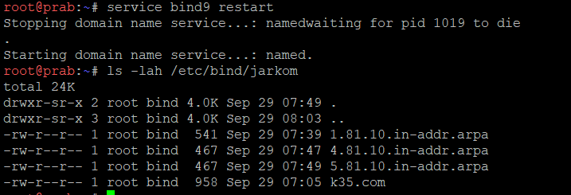

Kemudian, cek dengan AXFR:
``` 
dig @10.81.1.10 4.81.10.in-addr.arpa AXFR
```
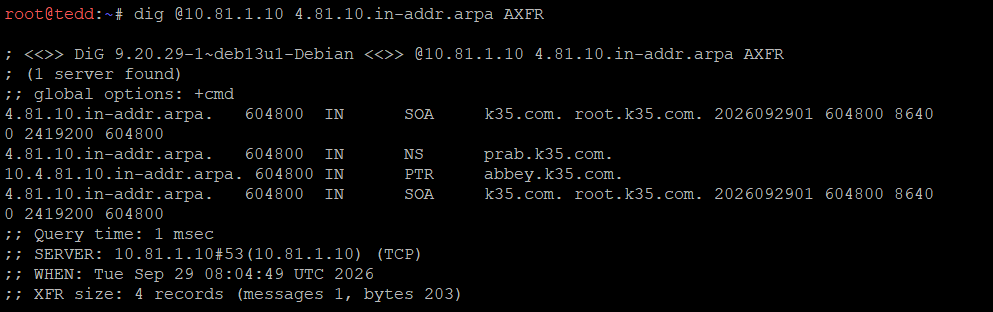

## Soal-9
Jalankan layanan web statis pada hostname di node area vault (menggunakan apache). Buka folder direktori /arsip/ dan aktifkan fitur autoindex (directory listing) pada konfigurasi Apache sehingga seluruh daftar file di dalamnya dapat ditelusuri langsung dari browser. Akses pengujian harus dilakukan melalui hostname, bukan IP address.

Untuk menjalankan layanan web statis pada hostname di node area vault, kita menginstall apache2 terlebih dahulu. Di sini vault adalah node obladi, sehingga command berikut dijalankan di obladi.
```
apt-get update
apt-get install apache2
```

Lalu, kita start apache tersebut.
```
service apache2 start
```
Selanjutnya, kita membuat folder direktori /arsip/.
```
mkdir -p /var/www/html/arsip
```
Lalu, kita buat konfigurasi ke `arsip.conf`
```
nano /etc/apache2/conf-available/arsip.conf
```
Konfigurasinya adalah sebagai berikut.
```
<Directory /var/www/html/arsip>
    Options +Indexes
    AllowOverride None
    Require all granted
</Directory>
```
`Options +Indexes` digunakan untuk mengaktifkan fitur autoindex (directory listing).

Kemudian, aktifkan konfigurasi arsipnya.
```
a2enconf arsip
```
Jalankan command ini setelah membuat konfigurasinya.
```
service apache2 reload
```
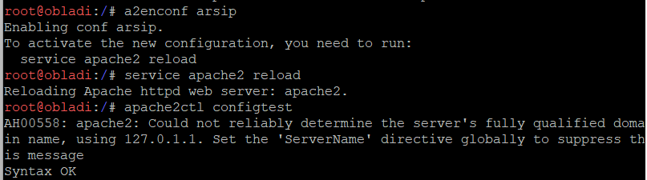

Pada arsip, kita mengisi beberapa file untuk mencoba melihat tampilan daftar file yang ditelurusi dari browser.
```
touch /var/www/html/arsip/file1.txt
touch /var/www/html/arsip/file2.txt
touch /var/www/html/arsip/data.pdf
```
Terakhir, kita jalankan di node lain, di sini kami menjalankannya di alpha dengan langsung melalui hostname obladi.
```
lynx http://obladi.k35.com/arsip/
```
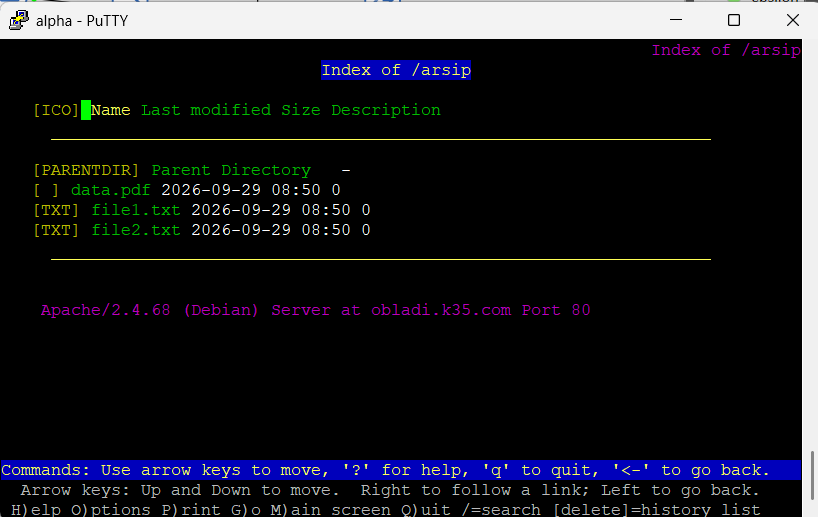

File yang sudah dibuat tadi, terlihat pada arsip.

## Soal-10
Jalankan layanan web dinamis (PHP-FPM) pada hostname di node core (menggunakan nginx). Buat sebuah aplikasi sederhana yang memuat halaman beranda dan halaman profil. Terapkan aturan rewrite pada server sehingga akses ke /profil dapat berfungsi dengan URL bersih (tanpa akhiran .php). Akses pengujian wajib dilakukan melalui hostname.

Untuk menjalan web dinamis pada node core yaitu oblada, kita menginstall nginx.
```
apt-get update
apt install nginx php php-fpm -y
```

Kemudian kita membuat aplikasi sederhana pakai php.
```
nano /var/www/jarkom/index.php
```
Isinya terdapat hyperlink menuju halaman profil.
```
<!DOCTYPE html>
<html>
<head>
    <title>Aplikasi</title>
</head>
<body>
    <h1>Halaman Beranda</h1>
    <p>Selamat datang di website Core Oblada.</p>
    <a href="/profil">Profil</a>
</body>
</html>
```

Pada konfigurasi, kita membuat agar profil.php dapat diproses oleh PHP-FPM sehingg akses ke /profil dapat berfungsi dengan URL bersih.
```
nano /etc/nginx/sites-available/default
```

Konfigurasinya adalah sebagai berikut.
```
    index index.php;
    server_name _;

    location / {
        try_files $uri $uri/ $uri.php?$query_string;
    }

    location ~ \.php$ {
        include snippets/fastcgi-php.conf;
        fastcgi_pass unix:/run/php/php8.4-fpm.sock;
    }
location ~ /\.ht {
                        deny all;
        }

        error_log /var/log/nginx/jarkom_error.log;
        access_log /var/log/nginx/jarkom_access.log;
}
```

Kemudian, pada `profil.php`, kita mengisi html berisi hyperlink menuju Beranda. 
```
nano /var/www/jarkom/profil.php
```
Isinya adalah sebagai berikut.
```
<!DOCTYPE html>
<html>
<head>
    <title>Profil</title>
</head>
<body>
    <h1>Halaman Profil</h1>
    <p>Ini adalah halaman profil.</p>
    <a href="/">Beranda</a>
</body>
</html>
```

Untuk validasi konfigurasi, jalankan command berikut,
```
nginx -t
```
Lalu, jalankan ulang untuk menyimpan perubahan.
```
service nginx restart
```
Jalankan command berikut.
```
lynx http://oblada.k35.com/
```
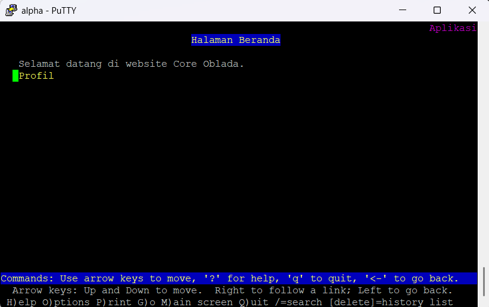

Kemudian, untuk profil adalah sebagai berikut.
```
lynx http://oblada.k35.com/profil
```
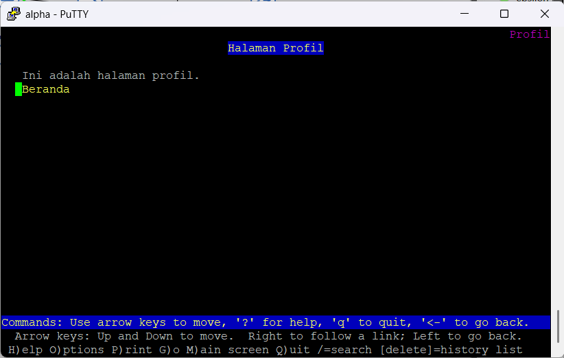

## Soal-11
Konfigurasikan Penny (menggunakan Apache) sebagai reverse proxy yang mengarah ke semua node di area vault (Obladi & Desmond). Sementara itu, konfigurasikan Abbey (menggunakan Nginx) sebagai reverse proxy menuju area core (Oblada & Molly). Pastikan kedua gerbang ini meneruskan identitas asli pengunjung ke server backend dengan melakukan forwarding header Host dan X-Real-IP. Buktikan bahwa Penny dan Abbey berhasil mendistribusikan lalu lintas dengan tepat.

Sebelum mengerjakan kita perlu membuat script pada beberapa console untuk mengatisipasi jika terjadi eror atau kejadian lain.

- Pada console Penny

Buat file untuk menaruh script
```
nano /root/setup-penny.sh
```
Isi script
```
#!/bin/bash

apt-get update
apt-get install -y apache2

# Aktifkan modul proxy dan header
a2enmod proxy proxy_http proxy_balancer lbmethod_byrequests headers

# Nonaktifkan default site
a2dissite 000-default.conf

# Buat konfigurasi reverse proxy
cat > /etc/apache2/sites-available/penny-proxy.conf << 'EOF'
<VirtualHost *:80>
    ServerName penny.k35.com
    ServerAlias www.k35.com vault.k35.com

    ProxyRequests Off
    ProxyPreserveHost On

    <Proxy "balancer://vault">
        BalancerMember http://10.4.13.4
        BalancerMember http://10.4.13.5
        ProxySet lbmethod=byrequests
    </Proxy>

    RequestHeader set X-Real-IP %{REMOTE_ADDR}s
    RequestHeader set X-Forwarded-For %{REMOTE_ADDR}s
    RequestHeader set X-Forwarded-Proto %{REQUEST_SCHEME}s

    ProxyPass / balancer://vault/
    ProxyPassReverse / balancer://vault/

    ErrorLog ${APACHE_LOG_DIR}/penny_error.log
    CustomLog ${APACHE_LOG_DIR}/penny_access.log combined
</VirtualHost>
EOF

a2ensite penny-proxy.conf
apache2ctl configtest && systemctl restart apache2

echo "=== STATUS APACHE ==="
systemctl status apache2 --no-pager
echo "=== MODUL PROXY ==="
apache2ctl -M | grep -E "proxy|header|balancer"
```

Jalankan script Penny
```
bash /root/setup-penny.sh
```

- Pada console Abbey
Buat file script
```
nano /root/setup-abbey.sh
```

Isi script
```
#!/bin/bash

apt-get update
apt-get install -y nginx

# Hapus default
rm -f /etc/nginx/sites-enabled/default

cat > /etc/nginx/sites-available/abbey-proxy.conf << 'EOF'
upstream core {
    server 10.4.13.6;
    server 10.4.13.7;
}

server {
    listen 80;
    server_name abbey.k35.com static.k35.com core.k35.com;

    location / {
        proxy_pass http://core;
        proxy_set_header Host              $host;
        proxy_set_header X-Real-IP         $remote_addr;
        proxy_set_header X-Forwarded-For   $proxy_add_x_forwarded_for;
        proxy_set_header X-Forwarded-Proto $scheme;
    }

    access_log /var/log/nginx/abbey_access.log;
    error_log  /var/log/nginx/abbey_error.log;
}
EOF

ln -sf /etc/nginx/sites-available/abbey-proxy.conf /etc/nginx/sites-enabled/
nginx -t && systemctl restart nginx

echo "=== STATUS NGINX ==="
systemctl status nginx --no-pager
echo "=== CEK UPSTREAM ==="
nginx -T 2>/dev/null | grep -A6 "upstream"
```

Jalankan
```
bash /root/setup-abbey.sh
```

- Pada console Alpha
Buat file script
```
nano /root/verify-proxy.sh
```
Isi script
```
#!/bin/bash

echo "============================================"
echo " PENNY (Apache) -> VAULT (obladi & desmond)"
echo "============================================"
for i in $(seq 1 6); do
    echo -n "Request $i -> "
    curl -s http://www.k35.com | grep -oiE "(obladi|desmond)" | head -1
done

echo ""
echo "============================================"
echo " ABBEY (Nginx) -> CORE (oblada & molly)"
echo "============================================"
for i in $(seq 1 6); do
    echo -n "Request $i -> "
    curl -s http://static.<xxxx>.com | grep -oiE "(oblada|molly)" | head -1
done

echo ""
echo "============================================"
echo " CEK HEADER X-Real-IP"
echo "============================================"
echo "-> Header dari Penny:"
curl -sI http://www.k35.com | grep -iE "x-real|x-forward|HTTP"

echo ""
echo "-> Header dari Abbey:"
curl -sI http://static.k35.com | grep -iE "x-real|x-forward|HTTP"
```

Jalankan
```
bash /root/verify-proxy.sh
```

Setelah itu kita perlu mengecek log backend di obladi dan pblada untuk mengecek menerima request dari penny dan Abbey.

Di obladi
```
tail -20 /var/log/apache2/access.log
```

Di oblada
```
tail -20 /var/log/nginx/access.log
```
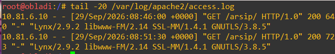

## Soal-12
Terdapat ruang khusus di penny yang yang menyimpan dokumen rahasia sindikat, oleh karena itu terapkan perlindungan basic authentication untuk path /admin. Akses ke jalur tersebut harus menolak pengunjung tanpa kredensial, dan hanya mengizinkan masuk jika menggunakan credential berikut:

username : prabs 

password : pakar_pinter_jadi_gob***

Langkah awal kita perlu menginstall apache2-utils untuk httpasswd di console penny.
```
apt-get install -y apache2-utils
```

Selanjutnya buat file kredensial
```
htpasswd -cb /etc/apache2/.htpasswd prabs pakar_pinter_jadi_gob***
```

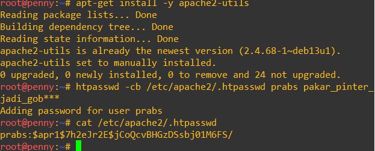

Selanjutnya kita perlu membuat direktori dokumen rahasia
```
mkdir -p /var/www/admin
echo "<h1>Dokumen Rahasia Sindikat</h1>" > /var/www/admin/index.html
chown -R www-data:www-data /var/www/admin
```

Selajutnya kita perlu konfigurasi virtual host apache. 
```
nano /etc/apache2/sites-available/000-default.conf
```
pada blok kode <VirtualHost *:80> tambahkan.
```
Alias /admin /var/www/admin
    <Directory /var/www/admin>
        AuthType Basic
        AuthName "Ruang Rahasia Sindikat"
        AuthUserFile /etc/apache2/.htpasswd
        Require valid-user
    </Directory>
```

Selanjutnya kita melakukan  testing pada klien.

Tanpa Kredensial
```
curl -I http://penny.10.81.1.10.com/admin/
```

Dengan Kredensial
```
 curl -u prabs:'pakar_pinter_jadi_gob***' http://10.81.5.10/admin/
```
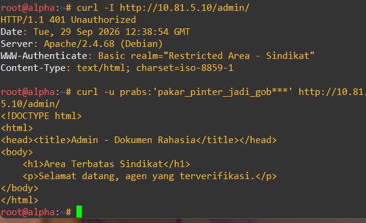

## soal-13
Setiap entitas dari luar harus memanggil gerbang dengan nama kanoniknya. Jika ada yang mencoba mengakses IP penny dan domain  penny.xxx.com, paksa sistem untuk melakukan redirect secara permanen (status code 301) menuju www.xxx.com. Sebaliknya, jika ada yang mengakses IP abbey dan domain abbey.xxx.com, lakukan redirect sementara (status code 302) menuju static.xxx.com.

Untuk memaksa pengalihan (redirect) kanonikal sesuai dengan skenario, kita akan menggunakan modul rewrite di Apache (node Penny) untuk redirect 301, dan menambahkan blok server baru di Nginx (node Abbey) untuk redirect 302.

Pertama kita perlu melakukan konfigurasi pada node penny menggunakan apache, sehingga kita memanfaatkan mod_rewrite untuk menangkap akses dari IP maupun domain penny.

```
RewriteEngine On
# Jika host yang diakses adalah IP Penny ATAU penny.<domain_anda>
RewriteCond %{HTTP_HOST} ^<IP_PENNY>$ [OR]
RewriteCond %{HTTP_HOST} ^penny\.<domain_anda>$
# Redirect permanen (301) ke www.<domain_anda>
RewriteRule ^(.*)$ http://www.<domain_anda>$1 [R=301,L]
```

Selanjutnya simpan file dan restart apache.
```
service apache2 restart
```
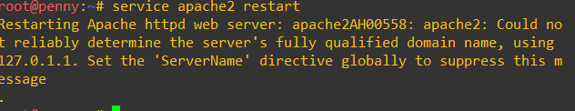

Selanjutnya kita perlu melakukan konfigurasi pada node abbey menggunaakan Nginx. Caranya adalah dengan membuat blok server khusus yang bertugas menangkap domain abbey dan IP, lalu return ke static.

```
server {
    listen 80;
    server_name abbey.10.81.1.10 10.81.4.10;
    return 302 http://static.10.81.1.10$request_uri;
}
```

Simpan file lalu cek sintaks dan restart nginx.
```
nginx -t
service nginx restart
```

Testing
Selanjutnya kita perlu melakukan testing pada node klien.

Test Penny
```
curl -I http://penny.10.81.1.10/
curl -I http://10.81.5.10/
```
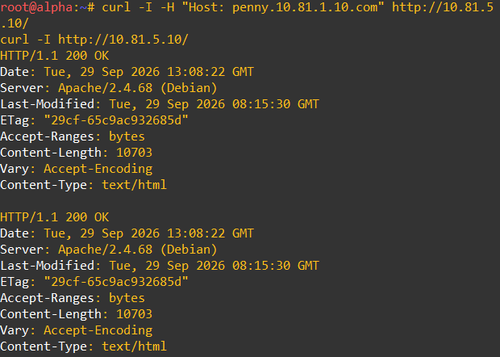

Test Abbey
```
curl -I http://abbey.10.81.1.10.com/
curl -I http://10.81.4.10/
```
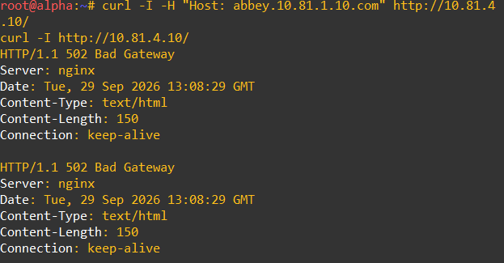

## Soal-14
Di dalam The Mesh, rekam jejak tidak boleh dipalsukan oleh sistem. Pastikan access log pada setiap server web di area vault maupun area core mencatat alamat IP asli milik client (pengunjung) yang diteruskan oleh gerbang, dan bukan mencatat IP dari Penny ataupun Abbey.

Untuk memastikan server backend mencatat IP asli pengunjung dan bukan IP dari reverse proxy (Penny/Abbey), kita harus mengonfigurasi modul pengenalan IP asli (Real IP) pada web server di area Vault (Obladi & Desmond) dan area Core (Oblada & Molly).

Untuk memastikan rekam jejak sistem, kami harus melakukan konfigurasi pada backend server agar dapat menerjemahkan HTTP header yang diteruskan oleh reverse proxy.

- Konfigurasi Area Vault
```
a2enmod remoteip
```
Buka konfigurasi virtual host apache
```
RemoteIPHeader X-Real-IP
RemoteIPTrustedProxy 10.81.5.10
```
Apache akan mengambil IP asli dari header X-Real-IP, asalkan paket tersebut datang dari IP proxy Penny 10.81.5.10
Simpan file
```
service apache2 restart
```

- Konfigurasi Area Core
Pada node Oblada dan Molly
```
set_real_ip_from 10.81.4.10;
real_ip_header X-Real-IP;
```
Nginx akan menimpa IP pengirim dengan IP yang ada di header X-Real-IP, jika paket dikirim oleh IP proxy Abbey 10.81.4.10

Testing Trigger Akses

Penny
```
curl -H "Host: www.10.81.1.10.com" http://10.81.5.10/static/
```
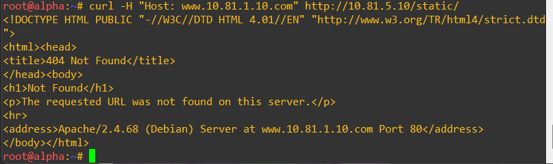

Abbey
```
curl -H "Host: static.10.81.1.10.com" http://10.81.4.10/app/
```
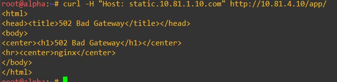

## Soal-15
Rootkit menginstruksikan pembuatan jalur proxy khusus yang berdiri sendiri. Pada penny buat reverse proxy untuk path /eternal yang menyajikan directory /var/www/eternal, dan pastikan path ini dapat mengeksekusi (rendering) file php. Pada abbey, buat jalur /orion yang menyajikan directory /var/www/orion, secara murni statis tanpa perlu rendering php.

Tujuannya adalah memastikan kedua web server memiliki jalur khusus dengan karakteristik layanan yang berbeda: Penny mendukung PHP, sedangkan Abbey hanya menyajikan file statis.

- Konfigurasi Node Apache

Langkah pertama instal Nginx dan PHP-FPM
```
apt update
apt install nginx php-fpm -y

# setelah selesai cek veri

php -v
ls -l /run/php/
```

Selanjutnya buat direktori yang akan digunakan oleh path eternal/
```
mkdir -p /var/www/eternal

# buat file PHP
nano /var/www/eternal/index.php

# Isi dengan
<?php
echo "<h1>Eternal</h1>";
echo "<p>PHP berhasil dirender pada Penny.</p>";
?>
```

Selanjutnya tambahkan Alias di konfigurasi Apache
```
nano /etc/apache2/sites-available/000-default.conf

# tambahkan
Alias /eternal /var/www/eternal
    <Directory /var/www/eternal>
        Require all granted
    </Directory>

# restart apache
service apache2 restart
```

- Konfigurasi Node Nginx

Buat direktori statis
```
mkdir -p /var/www/orion
echo "<h1>Halaman Statis Orion (Abbey) Berhasil!</h1>" > /var/www/orion/index.html
chown -R www-data:www-data /var/www/orion
```

Lalu tambahkan location di konfigurasi nginx

```
nano /etc/nginx/sites-available/default

# isi
location /orion {
        alias /var/www/orion/;
        index index.html;
    }

# simpan
nginx -t
service nginx restart
```

Testing
Guanakan node client untuk memverifikasi bahwa kedua endpoint tersebut dapat diakses dan merender konten yang tepat. Jika DNS masih bermasalah, gunakan IP secara langsung.

Test Path /eternal di Penny
```
curl http://10.81.5.10/eternal/
```
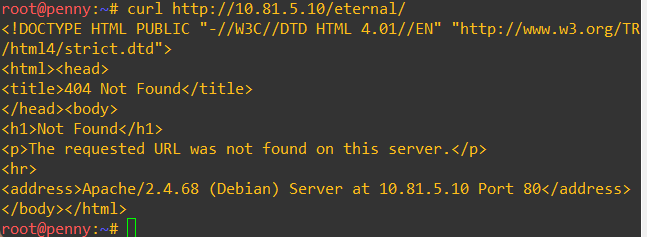

Test Path /orion di Abbey
```
curl http://10.81.4.10/orion/
```
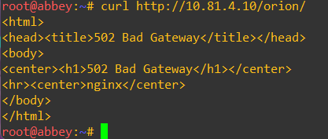

## Soal-16
Ketahanan gerbang The Mesh harus diuji untuk menghadapi bombardir permintaan. Salah satu Klien (misal: Alpha) bertugas melakukan stress test benchmark menggunakan ApacheBench. Lakukan 250 requests dengan tingkat konkurensi (concurrencies) 10 untuk masing - masing titik akhir: www.xxx.com dan static.xxx.com. Tampilkan rangkuman hasilnya.

Untuk melakukan stress test menggunakan ApacheBench, kita perlu mengeksekusinya dari node klien. Alat ini akan membombardir endpoint dengan 250 request di mana 10 request dijalankan secara bersamaan (concurrent).

Sebelumnya kita perlu melakukan installasi apachebench, pastikan sudah terinstall di client.
```
apt-get update
apt-get install apache2-utils -y
```

Stress Test
```
ab -n 250 -c 10 -H "Host: static.10.81.1.10.com" http://10.81.4.10/
```

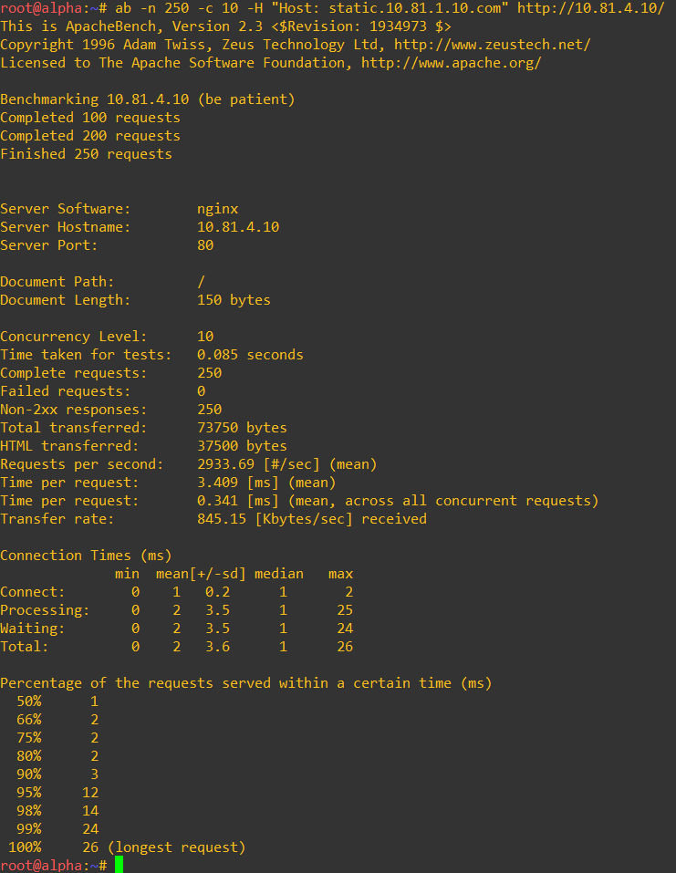

```
ab -n 250 -c 10 -H "Host: www.10.81.1.10.com" http://10.81.5.10/
```
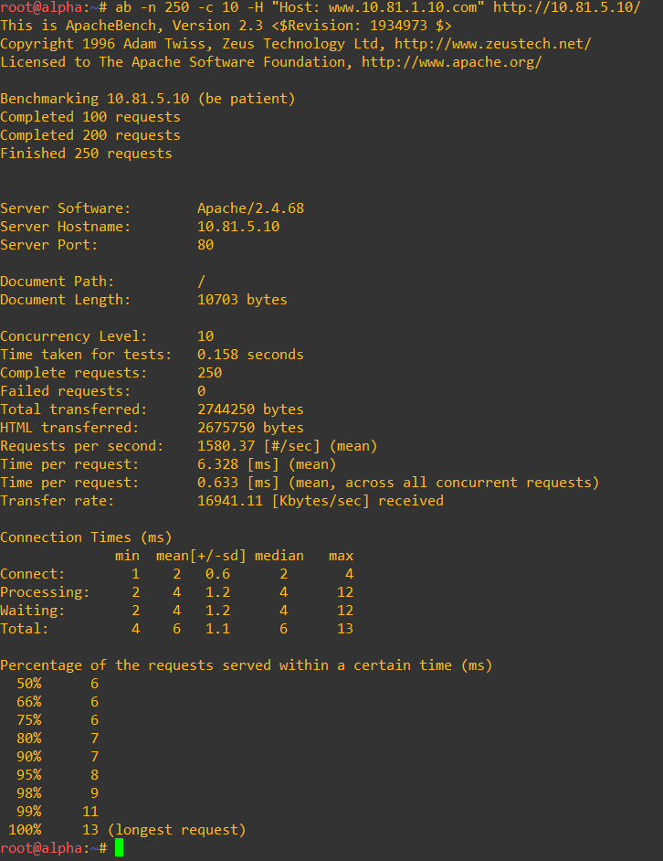


## Soal-17
Tambahkan TXT record pada DNS untuk semua klien sayap kiri dan sayap kanan (Alpha, Beta, Gamma, Delta, Epsilon). Jika DNS di-query TXT terhadap nama domain mereka (contoh: alpha.<xxxx>.com), sistem harus mengembalikan teks berupa nama hostname mereka masing-masing (contoh: "alpha").

Untuk menyelesaikan tugas ini, seluruh konfigurasi penambahan record DNS dilakukan terpusat di prab (sebagai DNS Master/ns1).

Kita perlu melakukan konfigurasi di node prab.
```
nano /etc/bind/jarkom/10.81.1.10.com

# isi

cat << 'EOF' > /etc/bind/jarkom/10.81.1.10.com
$TTL    604800
@       IN      SOA     prab.10.81.1.10.com. root.10.81.1.10.com. (
                        2026092902 ; Serial
                        604800     ; Refresh
                        86400      ; Retry
                        2419200    ; Expire
                        604800 )   ; Negative Cache TTL

@       IN      NS      prab.10.81.1.10.com.
@       IN      NS      tedd.10.81.1.10.com.

prab    IN      A       10.81.1.2
tedd    IN      A       10.81.1.3
penny   IN      A       10.81.5.10
abbey   IN      A       10.81.4.10

; TXT Records Klien Sayap Kiri dan Kanan
alpha   IN      TXT     "alpha"
beta    IN      TXT     "beta"
gamma   IN      TXT     "gamma"
delta   IN      TXT     "delta"
epsilon IN      TXT     "epsilon"
EOF

# restart bind9
service bind9 restart
```

Testing
```
dig @10.81.1.10 alpha.10.81.1.10.com TXT +short
```
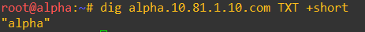

## Soal-18
Ubah A record DNS milik abbey.xxx.com ke alamat IP yang fiktif (ubah secara random namun pastikan format IP valid). Naikkan nilai serial SOA di prab dan pastikan tedd ikut tersinkron. Tetapkan TTL sebesar 15 detik pada record yang relevan tersebut. Verifikasi momen yang terjadi pada tiga fase pencarian: sebelum perubahan terjadi (mengembalikan IP lama), saat perubahan baru saja terjadi dalam jeda 15 detik (masih IP lama karena cache), dan setelah batas waktu TTL habis (berubah ke IP fiktif yang baru). 

Pada awal kita melakukan pengecekan dari node klien untuk melihat IP asli dari abbey sebelum dan sesudah.
```
dig abbey.10.81.1.10.com +short
```
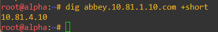

Selanjutnya kita melakukan konfigurasi perubahan IP dan TTL.
pada node prab
```
cat << 'EOF' > /etc/bind/jarkom/10.81.1.10.com
$TTL    604800
@       IN      SOA     prab.10.81.1.10.com. root.10.81.1.10.com. (
                        2026092904 ; Serial (Dinaikkan)
                        604800     ; Refresh
                        86400      ; Retry
                        2419200    ; Expire
                        604800 )   ; Negative Cache TTL

@       IN      NS      prab.10.81.1.10.com.
@       IN      NS      tedd.10.81.1.10.com.

prab    IN      A       10.81.1.10
tedd    IN      A       10.81.1.11
penny   IN      A       10.81.5.10
abbey   15      IN      A       10.81.99.99

; TXT Records Klien Sayap Kiri dan Kanan
alpha   IN      TXT     "alpha"
beta    IN      TXT     "beta"
gamma   IN      TXT     "gamma"
delta   IN      TXT     "delta"
epsilon IN      TXT     "epsilon"
EOF

service bind9 restart
```

Setelah itu langsung pergi ke node client dan jalankan
```
dig abbey.10.81.1.10.com +short
```
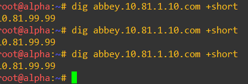

## Soal-19
Last? But not least? Buat CNAME record yang melakukan binding dari domain internal outbound.xxx.com menuju domain eksternal http.badssl.com, Lakukan perintah curl ke http://outbound.xxx.com dan pastikan output yang dihasilkan sesuai dengan isi konten di halaman http.badssl.com.

Untuk menyelesaikan soal ini, Kita perlu menambahkan record CNAME di DNS Master (prab) yang mengarahkan subdomain outbound ke domain eksternal http.badssl.com..

Sebelum melakukan testing kita perlu konfigurasi di node prab/dns master.
```
# buka file
nano /etc/bind/jarkom/10.81.1.10.com

# tambah di paling bawah
outbound    IN      CNAME   http.badssl.com.

# restart bind9
service bind9 restart
```

Testing
```
curl http://outbound.10.81.1.10.com/
```
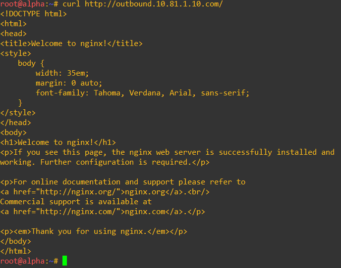

## Soal-20
Setelah semua penyelesaian selesai, pastikan semua service dan konfigurasi yang telah dikerjakan dari awal tetap berjalan normal dan berstatus autostart saat node di-restart (khusus untuk kasus ini, abaikan konfigurasi nomor 18 dan biarkan koordinat kembali normal).

Untuk menyelesaikan tahap akhir ini, kita harus mengembalikan konfigurasi IP abbey ke kondisi semula dan memastikan semua layanan inti (DNS, Apache, dan Nginx) otomatis menyala saat node di-restart (autostart). Karena Anda menggunakan image debinet (berbasis Debian), kita akan menggunakan perintah update-rc.d.

Buka terminal prab untuk mengembalikan IP fiktif abbey menjadi IP aslinya (10.81.4.10), menghapus TTL 15, dan menaikkan Serial SOA.

```
# Ganti IP fiktif kembali ke IP asli dan hapus TTL 15
sed -i 's/abbey\s*15\s*IN\s*A\s*10.81.99.99/abbey   IN      A       10.81.4.10/g' /etc/bind/jarkom/10.81.1.10.com

# Naikkan serial SOA (misal dari 2026092905 ke 2026092906)
sed -i 's/2026092905/2026092906/g' /etc/bind/jarkom/10.81.1.10.com

# Terapkan perubahan
service bind9 restart
```
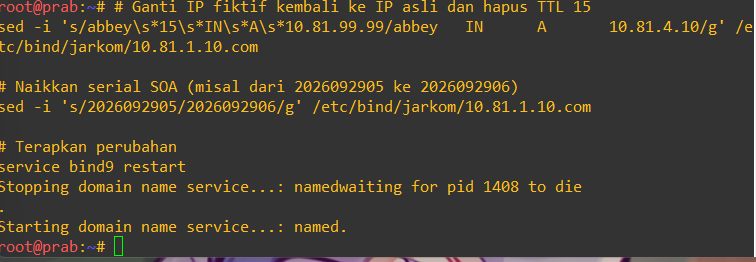
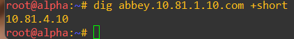

Selanjutnya kita perlu konfigurasi autostart service di setiap node.

node dns prab & tedd
```
update-rc.d bind9 defaults
```

node web server apache penny, obladi, desmond
```
update-rc.d apache2 defaults
```

node web server nginx abbey, oblada, molly
```
update-rc.d nginx defaults
```
Testing
Untuk melakukan test kita perlu mematikan salah satu node di gns3, lalu nyalakan kembali, lalu buka console  node tersebut isi dengan.
```
service apache2 status
```
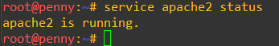
Konfigurasi ini diterapkan untuk layanan bind9 di node DNS, apache2 di gerbang dan vault, serta nginx di gerbang statis dan core. Pengujian dilakukan dengan mematikan dan menyalakan ulang (reboot) node di GNS3, di mana pengecekan menggunakan service apache2 status membuktikan bahwa seluruh layanan web maupun DNS otomatis berjalan (running) tanpa memerlukan intervensi manual.